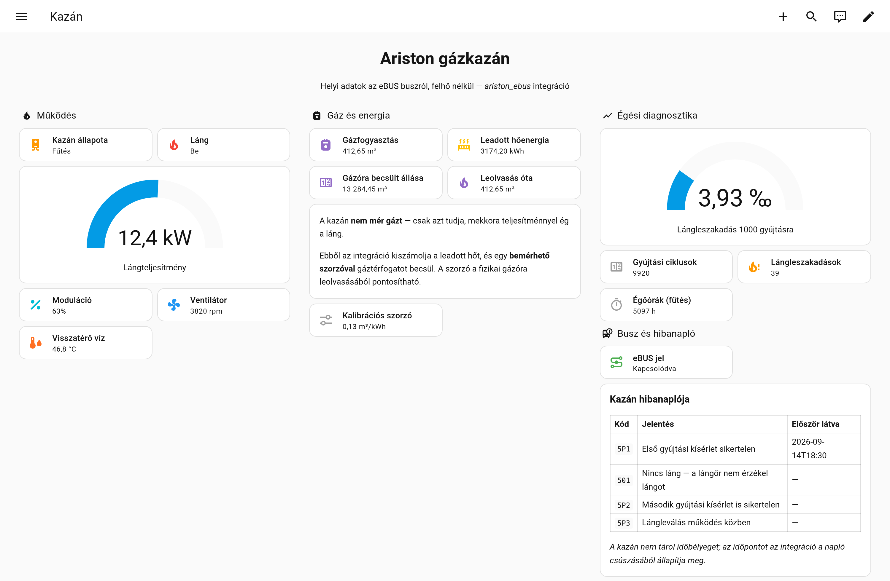

# Ariston eBUS (ebusd) — Home Assistant integráció

**BridgeNet** protokollt beszélő Ariston gázkazán bekötése Home Assistantba, **helyben, felhő
nélkül**, egy futó [ebusd](https://github.com/john30/ebusd) démonon keresztül.

> ### ⚠️ Olvasd el, mielőtt telepíted
>
> * **Ez az integráció kizárólag OLVAS.** Egyetlen íróparancsot sem küld a buszra: nem állít
>   célhőmérsékletet, nem kapcsol be és ki semmit. Nincs benne „veszélyes” funkció, mert
>   nincs benne vezérlés.
> * **Nem helyettesíti a gyári szabályozót**, a termosztátot, a biztonsági áramköröket
>   (lángőr, nyomáskapcsoló, túlmelegedés-védelem) és a szakképzett szerelőt. Ezek a kazán
>   saját vezérlésén futnak, és az integráció nem is fér hozzájuk.
> * **Közösségi visszafejtésen alapul**, nem gyártói dokumentáción. Saját felelősségre.
> * **Egyetlen készüléken van validálva:** Ariston Cares S System 24. Más BridgeNet-kazánon
>   működhet, de nem ígérjük — lásd [`docs/tamogatott-keszulekek.md`](docs/tamogatott-keszulekek.md).
>   Ha kipróbáltad, írd meg egy hibajegyben, és felvesszük a listára.

---

## Így néz ki

*Példa irányítópult a Home Assistant beépített kártyáival — nem kell hozzá HACS-bővítmény.
A képen látható értékek szemléltetésre valók (a kazán éppen fűt); a felépítés bemásolható:
[`docs/pelda-iranyitopult.yaml`](docs/pelda-iranyitopult.yaml).*

## Mit ad

| | |
|---|---|
| **Kazán működése** | állapot (készenlét / fűtés / melegvíz / keringetés…), láng, moduláció, ventilátor-fordulat, váltószelep, kazánvíz-hőmérséklet, víznyomás |
| **Gázfogyasztás** | a láng pillanatnyi teljesítményéből integrált hőenergia (kWh) → gáztérfogat (m³), a fizikai gázórához **bemérhető** szorzóval |
| **Diagnosztika** | égőórák, gyújtási ciklusok, lángleszakadások és a legfontosabb mérőszám: **hány lángleszakadás jut 1000 gyújtásra** |
| **Hibanapló** | a kazán 10 mélységű hibanaplója, magyar magyarázattal, és azzal az időponttal, amikor egy bejegyzés ELŐSZÖR megjelent |
| **Busz állapota** | az eBUS jel megléte — ha ez elmegy, minden érték beragad |

Minden entitás egyetlen eszköz alá kerül, magyar nevekkel (ha a Home Assistant nyelve magyar).

## Mire van szükség

1. **eBUS adapter.** A fejlesztés és a tesztelés ezzel készült:
   **[Elecrow eBUS Adapter Stick C6](https://www.elecrow.com/ebus-adapter-stick-c6.html)**
   (ESP32-C6, WiFi, „enhanced” protokoll). Bármelyik, az ebusd által támogatott adapter jó,
   akár soros, akár hálózati — lásd az [ebusd hardver-wikit](https://github.com/john30/ebusd/wiki/6.-Hardware).
2. **Futó ebusd** (a fejlesztéskor 26.1), betöltött Ariston CSV konfigurációval.
   A részletes beállítás: [`docs/ebusd-beallitas.md`](docs/ebusd-beallitas.md).
3. **Home Assistant 2025.2** vagy újabb. A fejlesztés és a tesztelés **2026.9.2**-n történt;
   a megadott minimum a használt API-k megjelenési verzióján alapul, de régebbi kiadáson nincs
   végigpróbálva. Ha régebbi verzión gondod van, nyiss hibajegyet, és pontosítjuk.

Az ebusd és a Home Assistant futhat ugyanazon a gépen vagy külön — az integrációnak csak az
ebusd **TCP parancsportját** (alapértelmezetten 8888) kell elérnie. MQTT **nem** kell.

## Telepítés

### HACS-ból (ajánlott)

1. HACS → ⋮ → *Custom repositories* → add hozzá ezt a repót *Integration* típussal.
2. Keresd meg az „Ariston eBUS (ebusd)” tételt, és telepítsd.
3. Indítsd újra a Home Assistantot.
4. *Beállítások → Eszközök és szolgáltatások → Integráció hozzáadása → Ariston eBUS*.
5. Add meg annak a gépnek a címét, ahol az **ebusd** fut (nem az adapterét), és a portot (8888).

### Kézzel

Másold a `custom_components/ariston_ebus` könyvtárat a Home Assistant `config/custom_components`
mappájába, indítsd újra, majd a 4-5. lépés ugyanaz.

## Beállítások

*Beállítások → Eszközök és szolgáltatások → Ariston eBUS → Beállítások*:

| Beállítás | Alapérték | Mit csinál |
|---|---|---|
| Lekérdezési ütem | 30 mp | Milyen sűrűn frissüljenek az értékek. A lassan változó regisztereket ettől függetlenül ritkán olvassuk (5 perc, illetve 1 óra). |
| Gázfogyasztás becslése | be | A lángteljesítményt hőenergiává integrálja, abból számol gáztérfogatot. |
| Hibanapló olvasása | be | 10 percenként kiolvassa mind a 10 bejegyzést. |

### Buszterhelés

A 2400 baudos eBUS lassú, ezért az integráció három sebességosztályt használ: a gyorsan
változó értékeket (állapot, láng, teljesítmény) 30 másodpercenként, az üzemóra-számlálókat
5 percenként, a beállításokat óránként frissíti. **Ami nem válaszol, azt megjegyzi:** két
sikertelen olvasás után az adott regisztert 6 órán át már csak a gyorsítótárból nézi.
Ez egy kazán-only rendszeren sokat számít, ahol a hőszivattyús és rendszerszabályzós
regiszterek eleve időtúllépésre futnak.

## A gázfogyasztás bemérése

A kazán nem mér gázt — csak azt tudja, mekkora teljesítménnyel ég a láng. Ebből az
integráció kiszámolja a leadott hőt, a gáztérfogathoz pedig egyetlen szorzó kell
(m³ gáz / kWh leadott hő). Kiindulásként **0,118** szerepel benne (1 m³ ≈ 9,4 kWh égéshő,
ebből ~90% hasznosul), de a valódi értéked ettől eltér.

**Bemérés:**

1. Olvasd le a fizikai gázórát, és hívd meg a `ariston_ebus.set_gas_meter_reading`
   szolgáltatást a leolvasott értékkel (a kazán eszközére célozva). Ez rögzíti a kiinduló pontot.
2. Fűtési idényben néhány hét múlva olvasd le újra, és hívd meg ismét.
3. Ha közben legalább 20 kWh hő termelődött, az integráció kiszámolja és beállítja a szorzót
   — és minden újabb leolvasással pontosabb lesz.

A szorzó kézzel is átírható (*Gáz kalibrációs szorzó* számmező). A `Gázfogyasztás` entitás
`device_class: gas`, tehát közvetlenül beköthető a Home Assistant **Energia** irányítópultjába.

> ⚠️ **A becslés csak a kazán fogyasztását tartalmazza.** Ha a házban más gázfogyasztó is van
> (tűzhely, gázbojler, konvektor), azok nem szerepelnek benne, ezért a becsült gázóra-állás
> idővel elcsúszik. Ilyenkor a „Gázfogyasztás” entitás továbbra is helyes (a kazánra nézve),
> de a gázóra-becslést ne használd számla-ellenőrzésre.

> **Miért pontos ez egyáltalán?** Mert a kapuzás miatt nem számol nem létező gázt: a kazán
> gyors broadcast állapotüzenete alapján a teljesítmény **nulla**, amikor nem éghet láng
> (készenlét, keringetés, nyomáshiány, lángkimaradás). E nélkül a láng kialvása után a
> beragadt kW-érték percekig „égne” tovább — egy mért próbafűtésen ez −8,6% hibát okozott.

## Entitások

Teljes lista, mértékegységekkel és azzal, hogy mi ismert és mi nem:
[`docs/entitasok.md`](docs/entitasok.md).

Az integráció **csak azokat az entitásokat hozza létre, amikre a rendszered valóban ad
értéket**. Egy kazán-only telepítésen ez tipikusan 25-30 entitás; hőszivattyúval vagy
rendszerszabályzóval (Sensys, Cube) több.

## Honnan származnak az adatok

Ez a projekt mások munkájára épül, és a saját méréseinkkel egészíti ki. A pontos elhatárolás
— **mi jött közösségi forrásból és mit fejtettünk meg mi** — a
[`docs/forrasok.md`](docs/forrasok.md) fájlban van, hivatkozásokkal.

A mérési jegyzetek, a regisztertérkép és a módszertan a [`docs/wiki/`](docs/wiki/) alatt
olvashatók (a visszafejtés naplója, magyarul).

Röviden:

* **Mások munkája:** az [ebusd](https://github.com/john30/ebusd) démon (John30), a
  [wrongisthenewright](https://github.com/wrongisthenewright/ebusd-configuration-ariston-bridgenet)
  Ariston CSV (v2.6), a [kredow](https://github.com/kredow/ariston-ebus-prococol) regisztertérkép,
  az [ysard](https://github.com/ysard/ebusd_configuration_chaffoteaux_bridgenet) Chaffoteaux-konfiguráció
  (innen a 10 mélységű hibanapló szerkezete), valamint az Ariston szervizkézikönyvek menüpontjai.
* **A mi hozzájárulásunk:** 264 broadcast regiszter dekódolása két saját mérésből, a zóna-blokk
  szerkezetének levezetése, a lángteljesítmény-regiszter helyi igazolása, a gázbecslés kapuzása és
  kalibrációs eljárása, a hibanapló csúszás-alapú időbélyegzése, és négy konkrét hiba javítása az
  ebusd konfigurációban ([`ebusd/NOTICE.md`](ebusd/NOTICE.md)).
* **Ami máig ismeretlen:** kb. 35 regiszter — ezeket is felsoroljuk, hogy más folytathassa.

## A tesztrendszer, amin készült

| | |
|---|---|
| Kazán | **Ariston Cares S System 24** (termékkód 3301636BFV), rendszerkazán külső tárolóval |
| Adapter | Elecrow eBUS Adapter Stick C6, WiFi, enhanced protokoll |
| ebusd | 26.1, Dockerben, `--scanconfig=off`, saját CSV-vel |
| Busz | egyetlen valódi slave (`0x3c`, a kazán) — se hőszivattyú, se rendszerszabályzó |
| Home Assistant | 2026.9, Dockerben |

## További olvasnivaló

| Dokumentum | Miről szól |
|---|---|
| [`docs/ebusd-beallitas.md`](docs/ebusd-beallitas.md) | Adapter, bekötés, ebusd indítása, hibakeresés |
| [`docs/entitasok.md`](docs/entitasok.md) | Minden entitás, mértékegységgel és korlátokkal |
| [`docs/tamogatott-keszulekek.md`](docs/tamogatott-keszulekek.md) | Mi van validálva, mi valószínű, mi nem vihető át |
| [`docs/forrasok.md`](docs/forrasok.md) | Honnan származnak az adatok, és mit fejtettünk meg mi |
| [`docs/wiki/`](docs/wiki/) | A visszafejtés naplója: regisztertérkép, módszertan, mérések |
| [`CHANGELOG.md`](CHANGELOG.md) | Változásnapló |
| [`ebusd/NOTICE.md`](ebusd/NOTICE.md) | Az ebusd konfiguráció eredete és a módosításaink |

## Licenc

* A repó saját kódja és dokumentációja: **MIT** ([`LICENSE`](LICENSE) — magyar
  tájékoztató fordítás: [`LICENSE-magyarul.md`](LICENSE-magyarul.md)).
* Az [`ebusd/`](ebusd/) könyvtár tartalma a forrásprojektből származó, módosított
  konfiguráció: **GNU GPL v3** ([`ebusd/LICENSE`](ebusd/LICENSE), részletek:
  [`ebusd/NOTICE.md`](ebusd/NOTICE.md)). Az eredetihez képesti pontos állapot:
  [`ebusd/UPSTREAM.md`](ebusd/UPSTREAM.md).
